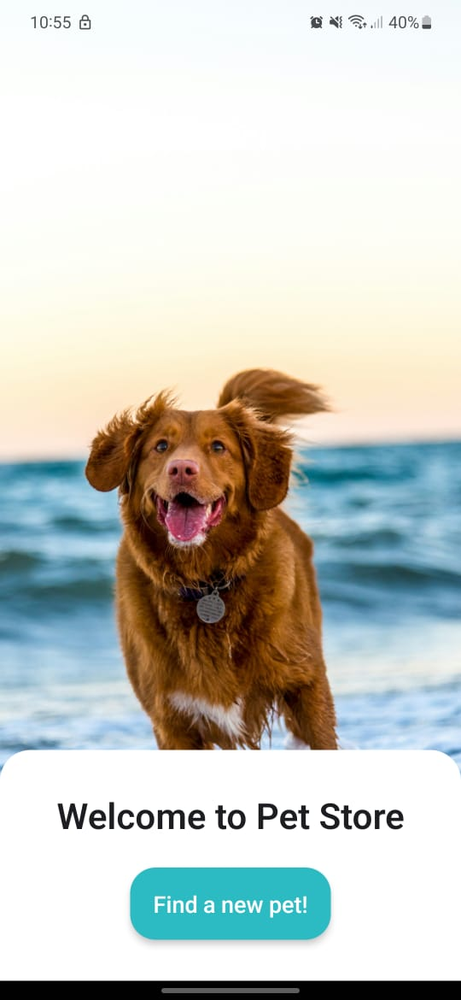

# Pet Store

Este é um app desenvolvido em React Native que permite recuperar e ordenar dados no formato JSON a partir de uma API fornecida.




## Tecnologias utilizadas

- React Native
- Expo
- Styled-components
- TypeScript

## Descrição

O aplicativo utiliza uma [API](http://petstore-demo-endpoint.execute-api.com/petstore/pets) externa que retorna dados no seguinte formato:

```json
[
  {
    "id": 1,
    "type": "dog",
    "price": 249.99
  },
  {
    "id": 2,
    "type": "cat",
    "price": 124.99
  },
  {
    "id": 3,
    "type": "fish",
    "price": 0.99
  }
]
```

## Funcionalidades

A aplicação apresenta três botões que executam diferentes tipos de ordenação nos dados recuperados:

- Ordenação por ID (Ascendente): Ordena os dados com base na propriedade "id".
- Ordenação por Tipo (Ascendente): Ordena os dados com base na propriedade "type".
- Ordenação por Preço (Ascendente): Ordena os dados com base na propriedade "price".

## Como executar

- Clone este repositório.
- Instale as dependências com o comando ```npm install```
- Execute o aplicativo no emulador ou em um dispositivo físico com ```npm run android``` ou ```npm run ios``` ou ```npm start```